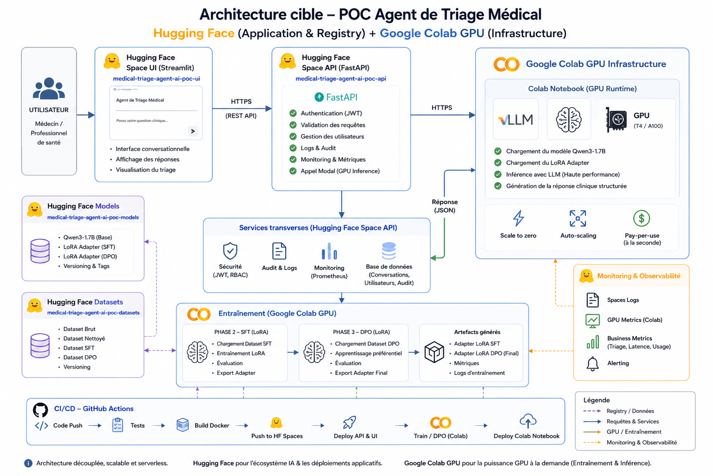

# 🏥🤖 Projet 14 - POC Agent IA de Triage Médical 

**Mission - Développez un agent IA avec LandGraph pour l'apprentissage des échecs**

✍️ **Auteur :** *[Raymond Francius]*    
📚 **Rôle :** *[Apprenant - Promotion Sept-2025]* — **Engineer AI** — **Openclassrooms**   
🗓️ **Date de mise à jour :** *[21-07-2026]*  

---

## Description

Ce projet correspond à un Proof of Concept (POC) d’un agent IA de triage médical basé sur un Large Language Model (LLM).

L’objectif est de développer un système capable :

- d’analyser des symptômes médicaux ;
- d’assister le personnel hospitalier ;
- d’estimer un niveau de priorité clinique ;
- de générer des recommandations médicales explicables.

---

# Architecture du projet

```text
backend/   → API, IA, datasets, entraînement, déploiement
frontend/  → Interface Streamlit
.github/   → CI/CD GitHub Actions
```

---

|  |

---

*API URL Swagger :*
[https://remdev-ai-medical-triage-agent-ai-poc-api.hf.space/docs](https://remdev-ai-medical-triage-agent-ai-poc-api.hf.space/docs)

*HF MODELS URL :* 
[https://huggingface.co/RemDev-AI/medical-triage-agent-ai-poc-models/tree/main/checkpoints](https://huggingface.co/RemDev-AI/medical-triage-agent-ai-poc-models/tree/main/checkpoints)

*HF DATASETS URL :* 
[https://huggingface.co/datasets/RemDev-AI/medical-triage-agent-ai-poc-datasets](https://huggingface.co/datasets/RemDev-AI/medical-triage-agent-ai-poc-datasets)


*Notebook Colab - GPU T4 - Training Pipeline :*
[https://github.com/RemDev-AI/medical-triage-agent-ai-poc/blob/main/backend/app/training/colab/training_pipeline_colab.ipynb](https://github.com/RemDev-AI/medical-triage-agent-ai-poc/blob/main/backend/app/training/colab/training_pipeline_colab.ipynb)
